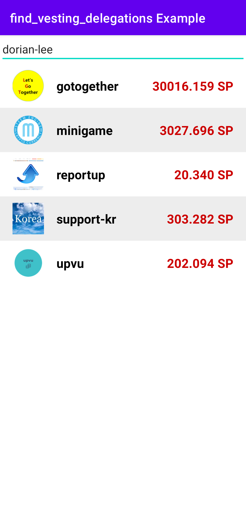

# Introduction

This sample project was created to implement loading vesting delegation list using find_vesting_delegation API.

---

# Screenshot

Input a Steemit account into the edit text view, and this app will show its vesting delegation list.

---

# References

* API
  * [database_api.find_vesting_delegations](https://developers.steem.io/apidefinitions/#database_api.find_vesting_delegations)
  * [Converting VESTS to STEEM](https://developers.steem.io/tutorials-recipes/vest-to-steem)
  * [condenser_api.get_dynamic_global_properties](https://developers.steem.io/apidefinitions/#condenser_api.get_dynamic_global_properties)
  * [database_api.get_dynamic_global_properties](https://developers.steem.io/apidefinitions/#database_api.get_dynamic_global_properties)
* Espresso
  * Overview: [In English](https://developer.android.com/training/testing/espresso) [한국어](https://developer.android.com/training/testing/espresso?hl=ko) 
  * Setup instructions: [In English](https://developer.android.com/training/testing/espresso/setup) [한국어](https://developer.android.com/training/testing/espresso/setup?hl=ko)
  * Basics: [In English](https://developer.android.com/training/testing/espresso/basics) [한국어](https://developer.android.com/training/testing/espresso/basics?hl=ko)