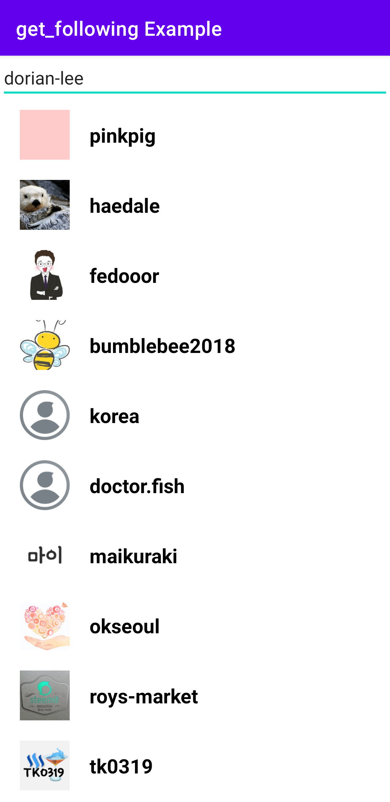

# Introduction

This sample project was created to implement loading following list.

---

# Screenshot

Input a steemit account into the edit text view, then this app will show its following list.

---

# References

* API
  * [get_following](https://developers.steem.io/apidefinitions/condenser-api#condenser_api.get_following)
* Espresso
  * Overview: [In English](https://developer.android.com/training/testing/espresso) [한국어](https://developer.android.com/training/testing/espresso?hl=ko) 
  * Setup instructions: [In English](https://developer.android.com/training/testing/espresso/setup) [한국어](https://developer.android.com/training/testing/espresso/setup?hl=ko)
  * Basics: [In English](https://developer.android.com/training/testing/espresso/basics) [한국어](https://developer.android.com/training/testing/espresso/basics?hl=ko)